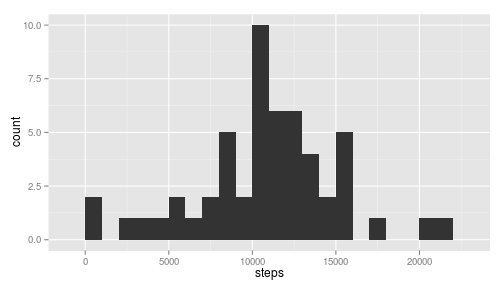
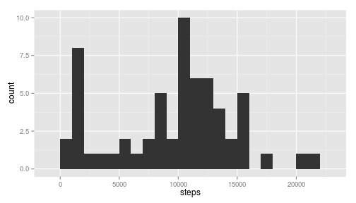
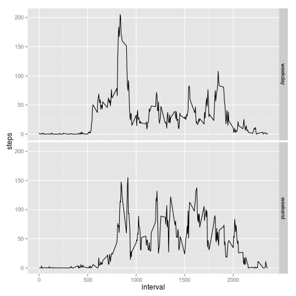

Reproducible Research: Peer Assessment 1
=======================================

## Loading and preprocessing the data

Unzip the file and load the csv into R.

```r
unzip("activity.zip")
activity <- read.csv("activity.csv")
head(activity)
```

```
##   steps       date interval
## 1    NA 2012-10-01        0
## 2    NA 2012-10-01        5
## 3    NA 2012-10-01       10
## 4    NA 2012-10-01       15
## 5    NA 2012-10-01       20
## 6    NA 2012-10-01       25
```

Use dplyr for this analysis.

```r
library(dplyr)
```

## What is mean total number of steps taken per day?

A quick look at the daily number steps distribution.

```r
library(ggplot2)
steps_by_day <- activity %>% group_by(date) %>% summarize(steps=sum(steps))
qplot(steps, data=steps_by_day, geom="histogram",binwidth=1000)
```

 

```r
m <- mean(steps_by_day$steps, na.rm=TRUE)
md <- median(steps_by_day$steps, na.rm=TRUE)
```

The average number of steps per day is 10766.19 and the median is 10765.

## What is the average daily activity pattern?


```r
by_interval <- activity %>% group_by(interval) %>% summarize(steps=mean(steps, na.rm=TRUE))
with( by_interval, plot(interval, steps, type="l"))
```

 

There seems to be a spike in activity in the morning.

The maximum number of steps over a 5 minutes interval is obtained in interval beginning at:

```r
by_interval$interval[which.max(by_interval$steps)]
```

```
## [1] 835
```

## Imputing missing values

There are a high number of intervals with missing values:

```r
sum(is.na(activity$steps))
```

```
## [1] 2304
```


```r
missing <- activity %>% filter(is.na(steps)) %>% select(date, interval)
summary(missing, maxsum=10)
```

```
##          date        interval     
##  2012-10-01:288   Min.   :   0.0  
##  2012-10-08:288   1st Qu.: 588.8  
##  2012-11-01:288   Median :1177.5  
##  2012-11-04:288   Mean   :1177.5  
##  2012-11-09:288   3rd Qu.:1766.2  
##  2012-11-10:288   Max.   :2355.0  
##  2012-11-14:288                   
##  2012-11-30:288                   
##  2012-10-02:  0                   
##  (Other)   :  0
```

The missing values are concentrated on 9 days for wi=hich there are no measurements at all.

In this case a simple imputing strategy could be to use the median value over that interval.

```r
median_by_interval <- activity %>% group_by(interval) %>% summarise(steps=median(steps, na.rm=TRUE))
impute <- function(steps, interval) {
    if(is.na(steps)) {
        median_by_interval$steps[median_by_interval$interval==interval]
    } else {
        steps
    }
}
imputed <- activity
imputed$steps <- mapply(impute,imputed$steps, imputed$interval)
```


```r
imputed_by_day <- imputed %>% group_by(date) %>% summarize(steps=sum(steps))
qplot(steps, data=imputed_by_day, geom="histogram",binwidth=1000)
```

 

```r
m <- mean(imputed_by_day$steps)
md <- median(imputed_by_day$steps)
```

After imputation the average number of steps per day is 9503.869 and the median is 10395.

Using the interval median for imputation seems to have reduced both the average and the median number of steps per day. 

## Are there differences in activity patterns between weekdays and weekends?

```r
imputed <- imputed %>%
    mutate(wkday = weekdays(strptime(imputed$date,format="%Y-%m-%d"))) %>%
    mutate(wkend = ifelse(wkday=="Sunday"|wkday=="Saturday", "weekend", "weekday"))
by_interval <- imputed %>% group_by(interval, wkend) %>% summarize(steps=mean(steps))
qplot(interval,steps,data=by_interval,facets=wkend~., geom="line")
```

 
